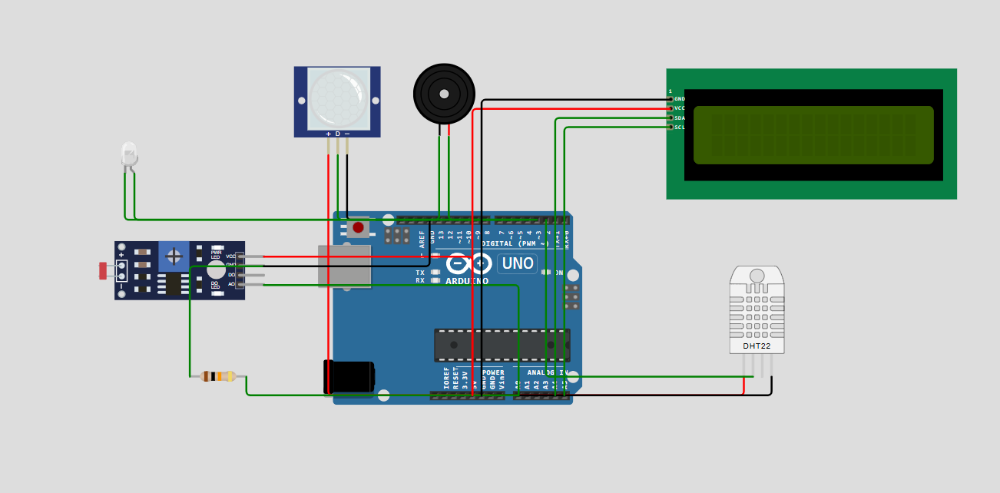

## Smart Home Project

This project simulates a basic smart home system using:
- PIR sensor for motion detection
- DHT22 sensor for temperature & humidity
- LDR for light sensing
- LCD to display readings
- Buzzer and LED as indicators

## Features
- Detects intruders
- Shows temperature, light
- Simulated in Wokwi

## How to Run
- Use Wokwi.com simulator
- Upload the code
- Simulate sensor inputs
- 

## Author
Nikhitha PB
